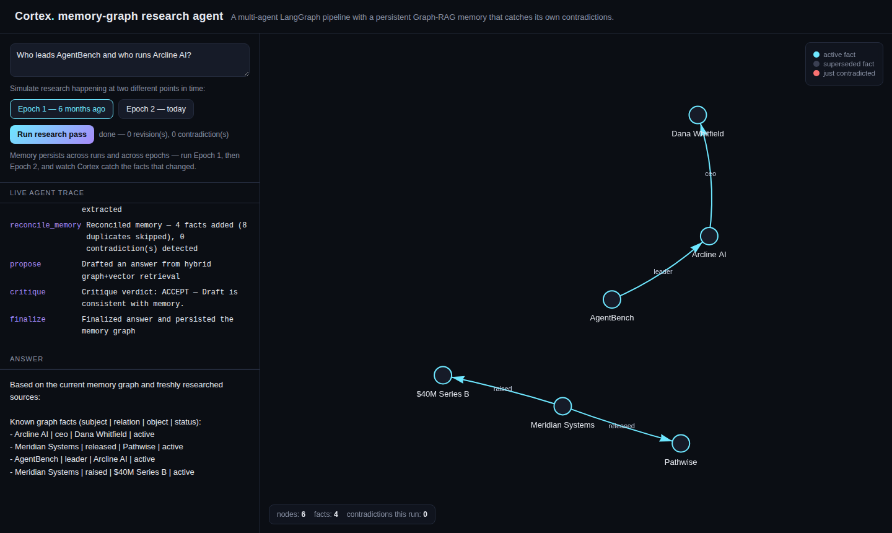
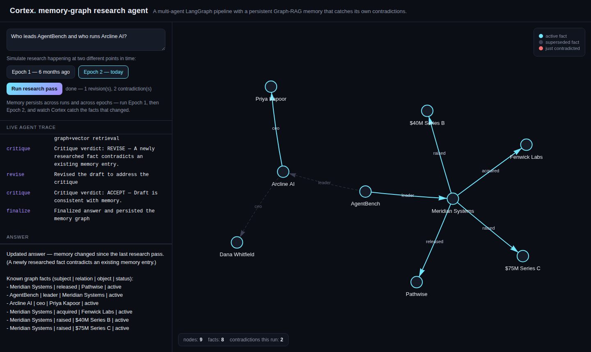
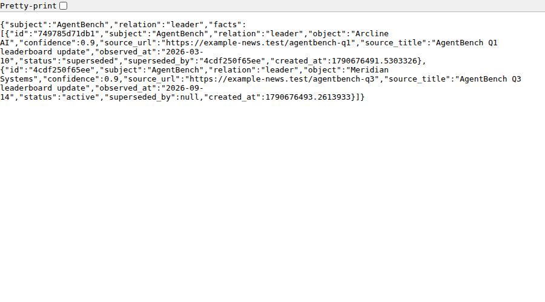

# Cortex — a research agent with a memory that catches its own contradictions

Most "AI agent memory" demos are a vector store bolted onto a chatbot: throw
text in, get semantically-similar text back out, hope nothing you stored
yesterday quietly disagrees with what you stored today. Cortex is a
multi-agent [LangGraph](https://github.com/langchain-ai/langgraph) research
system built around a different idea: memory should be a **temporal
knowledge graph** that knows what it currently believes, what it *used* to
believe, when that changed, and why — and an agent that re-researches a topic
should **notice when its own memory is wrong** instead of silently drafting
an answer from stale facts.

Ask it something, watch the knowledge graph grow live in the browser. Ask it
again after new information appears, and watch it catch the contradiction,
supersede the old fact (without deleting it — the full history stays
queryable), and revise its own draft answer to explain what changed.

> Built entirely with a zero-dependency default path: `git clone`, `pip
> install`, run — no API keys, no Neo4j server, no vector-DB account. Every
> "mock" component has a real, swappable production backend behind an
> environment variable.

## Why this exists

While researching what's actually being asked for in live AI Engineer /
Agentic Systems job postings right now, a pattern stood out: LangGraph-style
multi-agent orchestration, **Graph-RAG** (vector search *plus* graph
traversal, not either alone), knowledge graphs (Neo4j), and dedicated
long-term agent-memory frameworks (Mem0, Zep) keep showing up together as a
single, specific skill set — distinct from "build a RAG chatbot," which is
what most portfolios (including my other repos) actually demonstrate.

None of my other projects touched persistent, self-correcting memory, so
this fills that gap deliberately: it's the piece of the stack where a normal
RAG demo quietly breaks (it either has no memory across sessions at all, or
it overwrites old facts with new ones and never tells you anything changed).

## Architecture

```
                    ┌──────────┐
   user query  ───▶ │   plan   │  decompose into sub-queries
                    └────┬─────┘
                         ▼
                 ┌───────────────┐
                 │ parallel      │  fan out N researchers,
                 │ research      │  extract (subject, relation,
                 └───────┬───────┘  object) facts from each source
                         ▼
              ┌────────────────────┐
              │ reconcile memory   │  singular relations that changed
              │ (contradiction     │  value → supersede old fact,
              │  detection)        │  keep full history. cumulative
              └─────────┬──────────┘  relations (funding, releases,
                         │             acquisitions) just accumulate.
                         ▼
              ┌────────────────────┐        ┌─────────────────────┐
              │      propose       │◀──────▶│   hybrid retriever   │
              │  (draft an answer) │        │ vector chunks (Chroma)│
              └─────────┬──────────┘        │ + graph neighborhood  │
                         ▼                   │   (Neo4j / networkx)  │
              ┌────────────────────┐        └─────────────────────┘
              │      critique      │
              │ (forces a revise   │
              │  if a fact just    │
              │  changed and the   │
              │  draft ignores it) │
              └─────────┬──────────┘
                    REVISE │ ACCEPT
                         ▼        ▼
                  ┌──────────┐  ┌──────────┐
                  │  revise  │─▶│ finalize │──▶ answer + updated graph
                  └────┬─────┘  └──────────┘
                       │
                       └──────────────▲  (loops back into critique,
                                          bounded by MAX_REVISE_LOOPS)
```

Every node emits a structured event; the FastAPI layer streams them over
Server-Sent Events, and the frontend renders the growing graph live with
[vis-network](https://visjs.github.io/vis-network/).

## Key design decisions

- **Functional vs. cumulative relations.** A company has exactly *one*
  current CEO — a new observation contradicts the old one and supersedes it.
  A company can raise *several* funding rounds — a new one is just added.
  Treating every relation as "the new value replaces the old one" (what most
  toy knowledge-graph demos do) is wrong for half of all real-world facts.
  `cortex/models.py` encodes this distinction explicitly, and
  `cortex/contradiction.py` is the reconciliation logic it drives.
- **Facts are never deleted.** A superseded fact keeps its row
  (`status=superseded`, `superseded_by=<new fact id>`), so `GET
  /api/history?subject=AgentBench&relation=leader` returns the *entire*
  timeline, not just the current answer.
- **Graph-RAG, not vector-RAG.** Retrieval combines Chroma similarity search
  over raw source passages with graph traversal from the entities those
  passages (or the query) mention — so an answer can pull in a fact that
  came from a completely different document than the highest-scoring chunk.
- **Every backend is swappable, none are required.** LLM (mock ↔ Groq),
  search (offline fixture ↔ live DuckDuckGo), graph store (networkx+JSON ↔
  Neo4j), embeddings (deterministic hashing ↔ Sentence-Transformers). The
  interfaces live in `cortex/llm.py`, `cortex/search.py`,
  `cortex/memory/graph_store.py`, and `cortex/memory/vector_store.py`.
- **Deterministic by default, on purpose.** The bundled demo corpus
  (`cortex/demo_corpus.py`) is two hand-written "research passes" over a
  fictional AI-startup beat, six months apart, with a benchmark leader that
  changes and a CEO that changes. It exists so the contradiction-detection
  story is 100% reproducible for anyone cloning the repo — not dependent on
  whatever a live web search happens to return today.

## Quickstart

```bash
git clone https://github.com/JoshilFernandes/cortex-memory-agent.git
cd cortex-memory-agent
cp .env.example .env
pip install -r requirements.txt
uvicorn cortex.api:app --reload
```

Open http://localhost:8000, click **Epoch 1 — 6 months ago**, then **Run
research pass**. Watch the graph build itself and the agent trace stream in.
Now click **Epoch 2 — today** and run the *same query again* — watch it flag
the contradictions, revise its own answer, and the graph mark the old facts
as superseded (dashed, greyed out) instead of erasing them.

Or from the terminal:

```bash
python -m cortex.cli "Who leads AgentBench and who runs Arcline AI?" --epoch 1
python -m cortex.cli "Who leads AgentBench and who runs Arcline AI?" --epoch 2
```

Or with Docker (same zero-dependency default):

```bash
docker compose up --build
```

### Running with a real LLM and a real graph database

```bash
# .env
LLM_BACKEND=groq
GROQ_API_KEY=your-key-here     # free tier at console.groq.com

GRAPH_BACKEND=neo4j
NEO4J_URI=bolt://localhost:7687
```

```bash
docker compose --profile neo4j up --build   # also starts a real Neo4j
```

## API

| Endpoint | Description |
|---|---|
| `GET /api/research/stream?query=...&epoch=1` | SSE stream of the live agent trace, ending in a `done` event with the final answer |
| `GET /api/graph` | Current graph snapshot (nodes + edges) for visualization |
| `GET /api/history?subject=X&relation=Y` | Full temporal history for one (subject, relation) — active and superseded facts |
| `GET /health` | Liveness check |

## Testing & the eval suite

```bash
pip install -r requirements-dev.txt
pytest                              # 14 tests: contradiction logic, hybrid
                                     # retrieval, full pipeline runs, the
                                     # FastAPI layer, and a persistence-
                                     # across-restart check
python -m tests.test_eval_scenarios # human-readable pass/fail report —
                                     # same scenarios, gated in CI
```

All of it runs against the mock LLM and offline fixture corpus, so CI needs
no API keys and costs nothing to run on every push (see
`.github/workflows/ci.yml`).

## Screenshots

**The graph after Epoch 1** — a clean knowledge graph built from the first
research pass.



**Re-researching the same question in Epoch 2** — the live agent trace
catches two contradictions, forces a revision, and the graph keeps the
superseded facts (dashed, greyed out) right next to the new ones instead of
silently overwriting them.



**Full temporal history for one fact**, via `/api/history` — both the
superseded and the current value, with the link between them.



## Honest limitations

- The mock LLM's fact extraction is a curated lookup for the bundled demo
  corpus plus a light regex fallback — it is a deliberate stand-in for a
  real model, not a general-purpose NLP system. Set `LLM_BACKEND=groq` for
  real extraction quality on arbitrary text.
- The default hashing embedding is bag-of-words, not semantic — it's there
  so the project runs with zero downloads. `EMBEDDING_BACKEND=st` swaps in
  real sentence embeddings.
- Contradiction detection is relation-scoped (functional vs. cumulative), not
  a full entity-resolution system — two different surface strings for the
  same real-world entity ("Meridian Systems" vs. "Meridian Systems Inc.")
  are not automatically merged.

## License

MIT — see [LICENSE](LICENSE).
